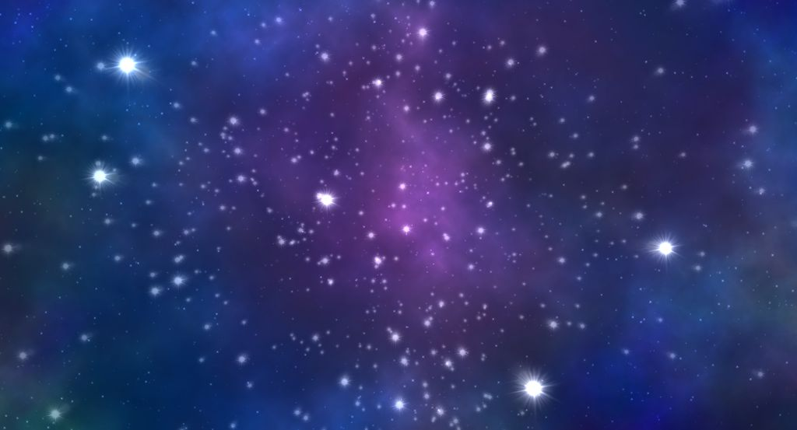

# REACTOS STARFIELD  SCREENSAVER

This is Starfield Screensaver for Windows and ReactOS, an OpenGL accelerated screensaver that simulates an animated space field.
It requires hardware acceleration for working with minimal CPU usage.
It works on Windows 9x/ME/NT4.0/2000/XP/Vista/7/8/8.1/10, both 32 bit and 64 bit platforms are supported.

## BUILDING FROM SOURCES

CMake is used for building the program with MinGW or Visual Studio.
After you downloaded the sources, by cloning the repository or after unpacking the ZIP file of the stable version, run the command:

cmake <path_to_sources>

After the configuration process completed, you can start the build by running tipically `make` or `ninja`, or open the solution file with Visual Studio.

## INSTALLATION

## NOTES
